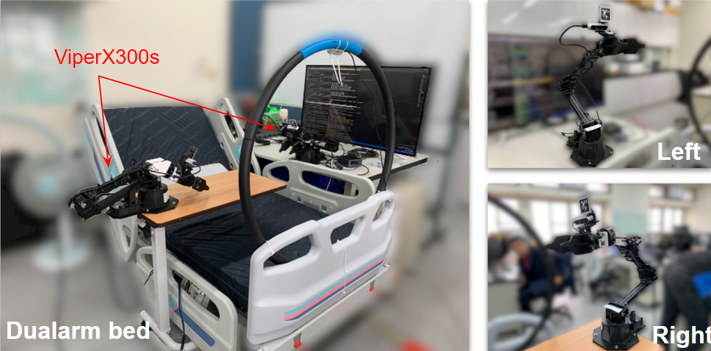

# DualArm_Handover_sys
This is a work about dual robotic object delivery system, using [ViperX300s Robotic Arm](https://www.trossenrobotics.com/viperx-300-robot-arm-6dof.aspx), [Intel D435 camera](https://www.intelrealsense.com/depth-camera-d435/), and [Robotiq FT 300 Force Sensor](https://www.robotics-3a.com/en/%e7%94%a2%e5%93%81_%e8%8b%b1%e6%96%87-2/ft-300-%e5%8a%9b%e5%92%8c%e6%89%ad%e7%9f%a9%e6%84%9f%e6%87%89%e5%99%a8_%e8%8b%b1%e6%96%87/), and can perform four clamping strategies for active/passive object delivery as well as static/dynamic situations. The pose estimateion model used in this work is refer to [HANet_V2](https://github.com/austin2408/HANet_v2).

Active/Passive delivery : Whether the user needs to actively place the object into the gripper and gripper need to wait for it.

Static/Dynamic : Whether the user can change the way they hold the object after the arm is activated.

# Medical Bed with dual ViperX300s Robotic Arms

# Demo
https://user-images.githubusercontent.com/60026936/154894725-8a136c54-9037-4264-a290-48a0dd92ce29.mp4

https://user-images.githubusercontent.com/60026936/154894901-deea0d31-0318-435c-87d5-76d7e6b6bb1e.mp4

